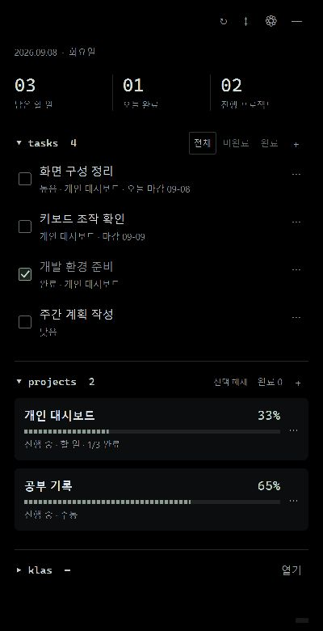

# windows_todo_widget for KWU

Windows 11 바탕화면에서 할 일과 프로젝트 진행률을 관리하는 할 일·프로젝트 관리 위젯입니다. **C# · WPF · .NET 8**로 구현했습니다.

## 실행 화면



실제 앱에 공개용 예시 데이터를 넣어 캡처한 화면입니다. 개인 할 일·프로젝트·계정 정보는 포함하지 않았으며, 처음 설치하면 빈 목록으로 시작합니다.

## 배경화면 주의사항

**검정 단색 배경화면을 권장합니다.** 위젯은 검은 바탕에 맞춘 디자인이므로 검정 배경에서 경계가 자연스럽게 어우러집니다. 밝은 색이나 사진 배경에서는 검은 사각형 영역이 눈에 띌 수 있습니다. 다른 배경에서도 기능은 동일하게 사용할 수 있습니다.

광운대학교 학생이라면 klas helper와 유사한 기능을 이용가능합니다


## 주요 기능

- 할 일 추가·수정·완료·삭제·삭제 취소, 우선순위·마감일·프로젝트 연결
- 프로젝트 상태 관리, 완료 프로젝트 기본 숨김과 별도 목록
- 진행률: 연결된 할 일 기준 / 수동 0~100% / 로컬 폴더의 마크다운 체크리스트
- tasks·projects·klas 섹션 접기, 창 이동·크기 조절, 트레이 표시·숨김·종료
- 로그인 시 자동 시작, 불투명도·항상 위 설정, 위치와 크기 복원
- 선택 기능: Notion 양방향 연결, 광운대학교 KLAS 남은 강의·과제 조회

첫 실행은 빈 상태이며, 로컬 할 일과 프로젝트는 계정이나 API 키 없이 사용할 수 있습니다. Notion과 KLAS는 각 사용자가 직접 연결합니다.

## 설치해서 사용하기

1. [최신 릴리스](https://github.com/donghwa-kang/windows_todo_widget/releases/latest)에서 `windows_todo_widget-setup-1.0.0-win-x64.exe`를 다운로드합니다. `Source code` ZIP은 개발용 소스입니다.
2. 설치 파일을 실행합니다. 기본 설치 위치는 현재 사용자의 `%LOCALAPPDATA%\Programs\WindowsTodoWidget`이며 관리자 권한은 필요하지 않습니다.
3. 설치가 끝나면 바탕화면 또는 시작 메뉴의 **Windows Todo Widget** 바로가기로 실행합니다. .NET 런타임은 설치 파일에 포함되어 있습니다.

- **켜기:** 바탕화면·시작 메뉴 바로가기 더블클릭
- **숨기기:** 위젯 상단 `—`
- **다시 표시:** 트레이의 표시 메뉴 또는 바로가기 더블클릭
- **완전히 끄기:** 트레이 메뉴의 종료
- **자동 시작:** 위젯 설정에서 켜기·끄기
- **제거:** Windows 설정 → 앱 → 설치된 앱 → Windows Todo Widget → 제거

업데이트·제거 전에는 트레이에서 위젯을 종료하세요. 제거할 때 할 일·프로젝트·로그인 캐시와 자격 증명은 보존합니다. 완전한 개인 데이터 삭제가 필요한 경우 아래 저장 위치도 별도로 관리해야 합니다. 설치 파일에는 개인 데이터가 들어 있지 않습니다.

설치 파일은 아직 코드 서명되지 않았습니다. 배포 파일의 SHA-256 값은 같은 릴리스의 `SHA256SUMS.txt`에 제공합니다. KLAS 연결에는 별도의 Microsoft Edge WebView2 Runtime이 필요합니다.

## 소스에서 실행 및 빌드

Windows 11 x64와 [.NET 8 SDK](https://dotnet.microsoft.com/download/dotnet/8.0)가 필요합니다. KLAS 연결에는 [Microsoft Edge WebView2 Runtime](https://developer.microsoft.com/microsoft-edge/webview2/)이 필요합니다. 최초 빌드에서는 NuGet 패키지를 다운로드합니다.

```powershell
git clone https://github.com/donghwa-kang/windows_todo_widget.git
cd windows_todo_widget
dotnet run --project TerminalWidget.csproj
```

배포 폴더 생성:

```powershell
dotnet publish TerminalWidget.csproj -c Release -r win-x64 --self-contained false -o publish
.\publish\TerminalWidget.exe
```

배포 시 `publish` 폴더 전체를 전달하세요. 수신 PC에는 .NET 8 **Desktop Runtime**이 필요합니다. .NET 런타임을 포함하려면 `--self-contained true`로 빌드하세요. WebView2 Runtime은 별도입니다. 설치 파일 배포는 위의 최신 릴리스에서 받을 수 있습니다.

창이 보이지 않으면 `TerminalWidget.exe --window`로 실행하여 일반 창 복구 모드를 사용하세요. 이미 실행 중이면 기존 창을 다시 표시합니다.

## 사용 방법

- 상단 버튼 왼쪽의 빈 영역을 드래그하여 이동하고 오른쪽 아래에서 크기를 조절합니다.
- tasks의 `+`를 누르면 추가 창이 열립니다. Enter로 저장, Escape로 취소합니다.
- 제목 또는 체크 상자를 눌러 완료를 전환하고 `⋯`에서 수정·삭제합니다.
- projects의 `+`로 생성하고 카드를 선택해 연결된 할 일을 봅니다. `선택 해제`로 전체 할 일을 표시합니다.
- 완료 상태 프로젝트는 `완료 N`에서 확인하며 `진행 보기`로 돌아옵니다. 진행률 100%와 프로젝트의 완료 상태는 별개입니다.
- 완료·미완료 상태는 날짜가 바뀌어도 유지됩니다. 요약의 ‘오늘 완료’만 로컬 날짜 기준입니다.
- `↻` 새로고침, `↕` 전체 접기, `⚙` 설정, `—` 숨기기. 종료는 트레이 메뉴에서 합니다.
- 일반 안내는 잠시 뒤 사라지고 오류는 유지됩니다. 스크롤바는 조작 중에 표시됩니다.

로그인 자동 시작은 기본 활성화되며 설정에서 해제할 수 있습니다. 실행 폴더를 옮기면 새 위치에서 한 번 실행해 시작 경로를 갱신하세요.

## 프로젝트 자동 진행률

프로젝트 폴더 루트의 `PROGRESS.md`, `TASKS.md`, `TODO.md`, `PLAN.md`를 지원합니다. 여러 파일이 있으면 기준 파일을 직접 선택합니다. UTF-8, 최대 1MB이며 하위 폴더·코드는 스캔하지 않고 링크 파일은 읽지 않습니다.

최하위 `- [x]` 개수 / 전체 최하위 체크 항목 개수로 계산합니다. 상위 단계, 코드 블록, HTML 주석은 제외합니다. 연결할 때와 `↻`를 누를 때 파일을 읽으며, 불명확하거나 읽기 실패한 자료로 진행률을 추측하지 않습니다. `PROGRESS.template.md`를 참고하세요.

ChatGPT·Codex 계정의 프로젝트를 직접 조회하는 기능은 없습니다. 로컬 폴더의 작업 기록을 사용하거나 수동 진행률을 지정하세요.

## Notion 연결 (선택)

`⚙ → 노션 양방향 연결`에서 **기존 데이터베이스 연결** 또는 **새 할 일 데이터베이스 만들기**를 선택할 수 있습니다.

### 데이터베이스가 없는 경우

1. Notion에서 내부 연결을 만들고 읽기·삽입·수정 권한을 활성화합니다.
2. 데이터베이스를 둘 부모 페이지를 열고, 페이지의 연결 메뉴에서 해당 내부 연결을 추가합니다. 토큰만 발급하는 것으로는 페이지 접근 권한이 생기지 않습니다.
3. 위젯에서 **새 할 일 데이터베이스 만들기**를 선택하고 부모 페이지 링크(또는 페이지 ID)와 내부 연결 토큰을 입력합니다.
4. **생성 및 연결**을 눌러 확인하면 해당 페이지 아래에 `할 일 & 일정`과 아래 다섯 속성·선택값이 생성됩니다. 데이터 소스 ID는 자동으로 연결되므로 별도로 찾을 필요가 없습니다.

생성 중에는 중복 클릭을 막습니다. 통신 오류로 생성 결과가 불확실하면 앱을 다시 실행해도 대기 기록을 유지하고 자동 재생성하지 않습니다. 부모 페이지에서 결과를 확인한 뒤, 이미 생성됐다면 **기존 데이터베이스 연결**로 이어가세요. 생성된 ID를 받은 경우 설정에 표시됩니다. **생성 대기 기록 해제**는 확인 후 로컬 대기 기록만 지우며 원격 데이터베이스는 삭제하지 않습니다.

연결 대상 변경은 기존 위젯의 노션 목록을 새 목록으로 교체하지만 기존 노션 원본과 로컬 할 일은 삭제하지 않습니다. [Notion 데이터베이스 생성 API](https://developers.notion.com/reference/create-a-database)를 사용하며 생성 요청을 자동 재시도하지 않습니다.

### 기존 데이터베이스를 사용하는 경우

1. 본인의 Notion 내부 연결을 만들고 대상 원본 데이터베이스에 읽기·삽입·수정 권한을 부여합니다.
2. 다음 속성을 만듭니다. 속성 이름과 종류가 일치해야 합니다.

| 속성 이름 | 종류 | 값 |
| --- | --- | --- |
| 이름 | 제목 | 할 일 제목 |
| 완료 | 체크박스 | 완료 여부 |
| 일정 | 날짜 | 선택 마감일 |
| 우선순위 | 선택 | `1 · 높음`, `2 · 보통`, `3 · 여유` |
| 유형 | 선택 | 새 항목에 `할 일` 사용 |

3. `⚙ → 노션 양방향 연결`에 **data_source_id**와 내부 연결 토큰을 입력합니다. 페이지 URL의 ID나 보기(view) ID와는 다릅니다. 데이터베이스 조회 API의 `data_sources` 목록에서 해당 소스를 확인할 수 있습니다. [Notion 데이터 소스 안내](https://developers.notion.com/docs/upgrade-guide-2025-09-03)
4. `연결 확인 및 시작`을 누릅니다. 속성과 권한 검증 후 첫 목록을 가져옵니다.

토큰은 Windows 자격 증명 관리자에 보관하며 코드·JSON 내보내기에 넣지 않습니다. 데이터 소스 ID는 로컬 캐시에 저장합니다. 소스를 바꾸면 확인 후 위젯의 노션 목록을 교체하며 원격 항목은 삭제하지 않습니다. 개인 ID가 고정되어 있던 이전 버전에서 업데이트하면 데이터 소스 ID를 한 번 설정해야 합니다.

Notion의 변경은 `↻`를 누를 때 가져오고, 위젯의 Notion 항목 추가·수정·삭제는 즉시 전송합니다. 자동 주기 조회는 없습니다. 로컬 프로젝트의 할 일은 로컬에 남습니다. 삭제는 휴지통 이동입니다. 데이터베이스의 모든 행을 조회하므로 **위젯 전용 데이터 소스**를 권장합니다.

충돌을 확인한 뒤 수정하지만 API의 원자적인 조건부 수정은 아니므로 동시 편집을 완전히 방지하지는 못합니다. 응답을 잃은 생성 요청은 자동 재시도하지 않으며 설정에서 결과를 확인합니다. 외부에서 완료한 일을 임의로 ‘오늘 완료’에 포함하지 않습니다.

## KLAS 연결 (선택)

`klas → 열기`에서 공식 KLAS 화면에 직접 로그인한 뒤 학기를 확인하고 `현황 가져오기`를 누릅니다. 크롬과 별도인 내장 WebView2 세션을 사용하며 KLAS Helper 설치는 필요 없습니다.

이후 `↻`로만 다시 조회합니다. 남은 온라인 강의·미제출 과제 중 마감 전 항목을 과목별로 표시하며 추가 제출 기한을 반영합니다. 팀 프로젝트·퀴즈는 포함하지 않습니다. 정상 조회에서 남은 항목이 없으면 ‘남아있는 항목이 없습니다. 깔끔하네요!’가 표시됩니다. 조회 실패 시 이전 목록을 유지합니다.

연결 창을 닫으면 숨겨서 세션을 재사용하고 절전을 요청합니다. 자동 세션 연장은 하지 않으며 서버 만료나 앱 재시작 후 재로그인이 필요할 수 있습니다. 이 프로젝트는 학교의 공식 앱이 아니며, 수동 조회가 학교의 사용 승인을 의미하지 않습니다. 본인 계정과 접근 권한 범위에서 학교 정책을 확인하여 사용하세요. KLAS 내부 응답 변경 시 기능 수정이 필요할 수 있습니다.

조회 경로와 판정 기준은 [KLAS Helper 공개 구현](https://github.com/kw-service/klas-helper-extension/blob/main/src/routes/home.js)을 참고했습니다. 확장 프로그램 자체는 번들하지 않습니다.

## 데이터와 공개 범위

- 로컬 데이터: `%LOCALAPPDATA%\TerminalWidget\workspace.json`
- Notion 현황·연결 설정: 같은 폴더의 `notion-cache.json`
- KLAS 현황·브라우저 세션: 같은 폴더의 `klas-cache.json`, `klas-browser`
- 직전 저장은 `.bak`, 손상 원본은 `.corrupt-*`로 보존합니다.
- JSON 내보내기는 실제 할 일·프로젝트 이름·로컬 경로를 포함할 수 있으므로 공개하지 마세요.
- 인증 토큰, 쿠키, 개인 캐시, 로그, 바로가기, 로컬 빌드 결과는 저장소에 포함하지 않습니다. `.gitignore`로 제외합니다.
- GitHub에 게시되는 것은 소스와 테스트·문서이며, 계정 연결이나 개인 데이터가 함께 공유되지 않습니다.

## 검증

```powershell
dotnet run --project Tests/CoreTests.csproj -c Release
node Tests/klas-reader.test.cjs
```

JS 테스트는 Node.js 22 이상이 필요합니다. 자동 테스트는 진행률·날짜 경계·완료 취소·프로젝트 삭제·저장 복원·Notion 모의 응답·KLAS 판정을 검사합니다. GitHub Actions에서도 Windows 빌드와 테스트를 실행합니다. 실제 Notion 쓰기 및 KLAS 로그인은 개인 계정 없이 자동 검증하지 않습니다.

## 구조와 제약

`Core/`: 데이터·검증·계산·저장. `Platform/`: Windows 통합·Notion HTTP·KLAS 조회. `WidgetWindow.cs`: 위젯 화면. `Dialogs.cs`, `*Theme.xaml`: 입력창과 공통 디자인. `Tests/`: 외부 계정 없이 실행하는 테스트.

바탕화면 부착은 Explorer의 창 구조를 이용하며 Windows의 공식 위젯 API가 아닙니다. 실패하면 일반 창으로 전환합니다. Explorer 재시작, Windows 업데이트, 다중 모니터·DPI에 따라 차이가 있을 수 있습니다. 창 연결 점검 타이머는 외부 서비스 조회와 별개입니다.

## 설치 파일 재빌드

Windows에서 Inno Setup 6과 .NET 8 SDK, Node.js 22 이상을 설치한 뒤 새로운 소스 체크아웃에서 다음 명령을 실행합니다. 설치 파일과 해시는 artifacts/release에 생성됩니다.

```powershell
.\scripts\Build-Release.ps1
```

아이콘 원본은 Assets/app.svg이며 scripts/New-AppIcon.ps1로 여러 해상도의 ICO를 생성할 수 있습니다.
